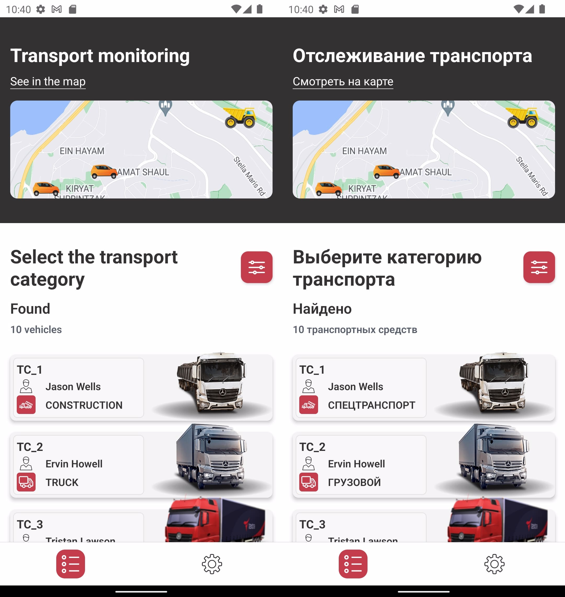
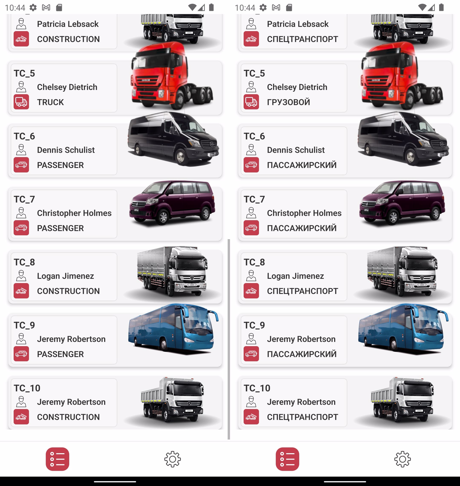
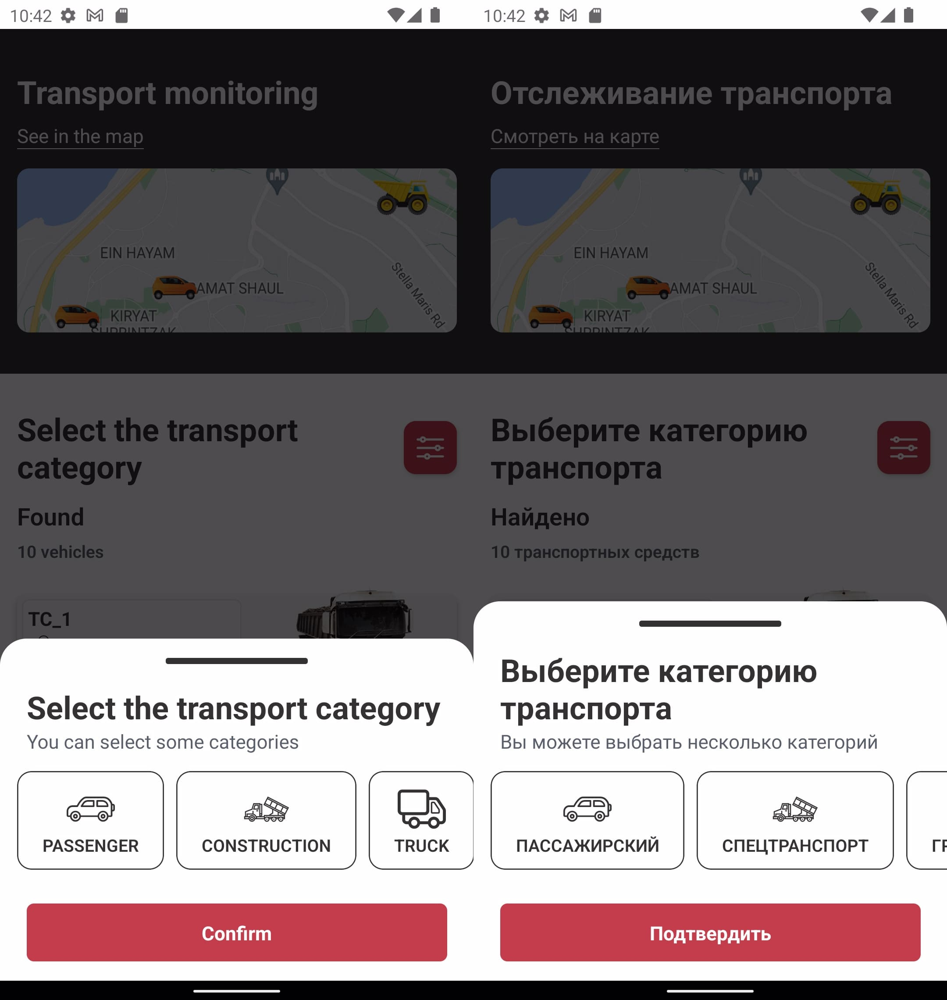
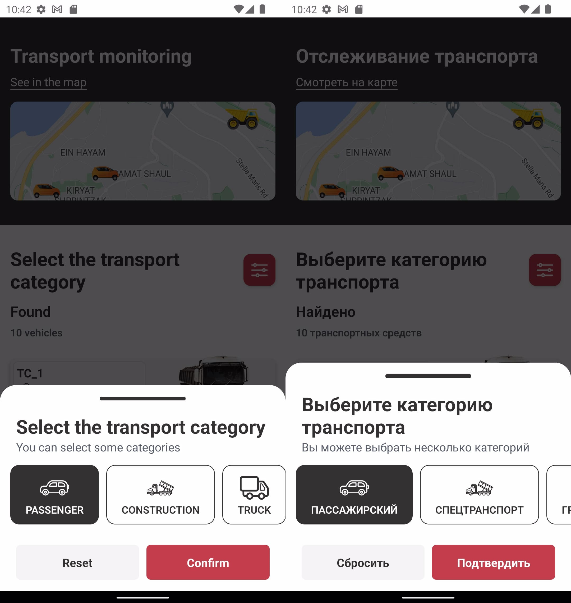
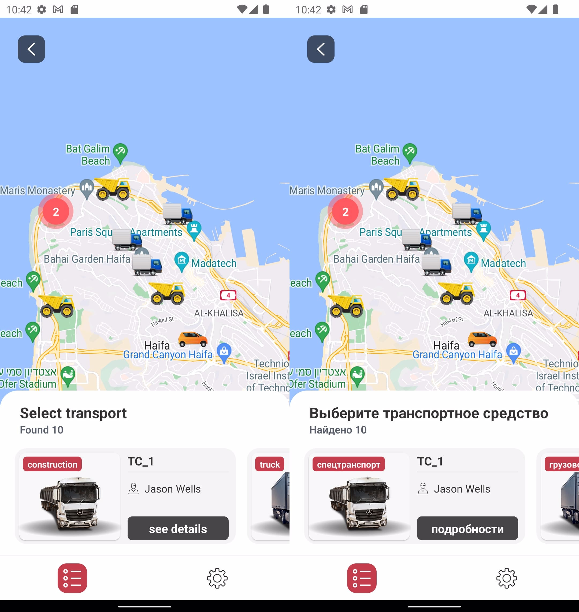
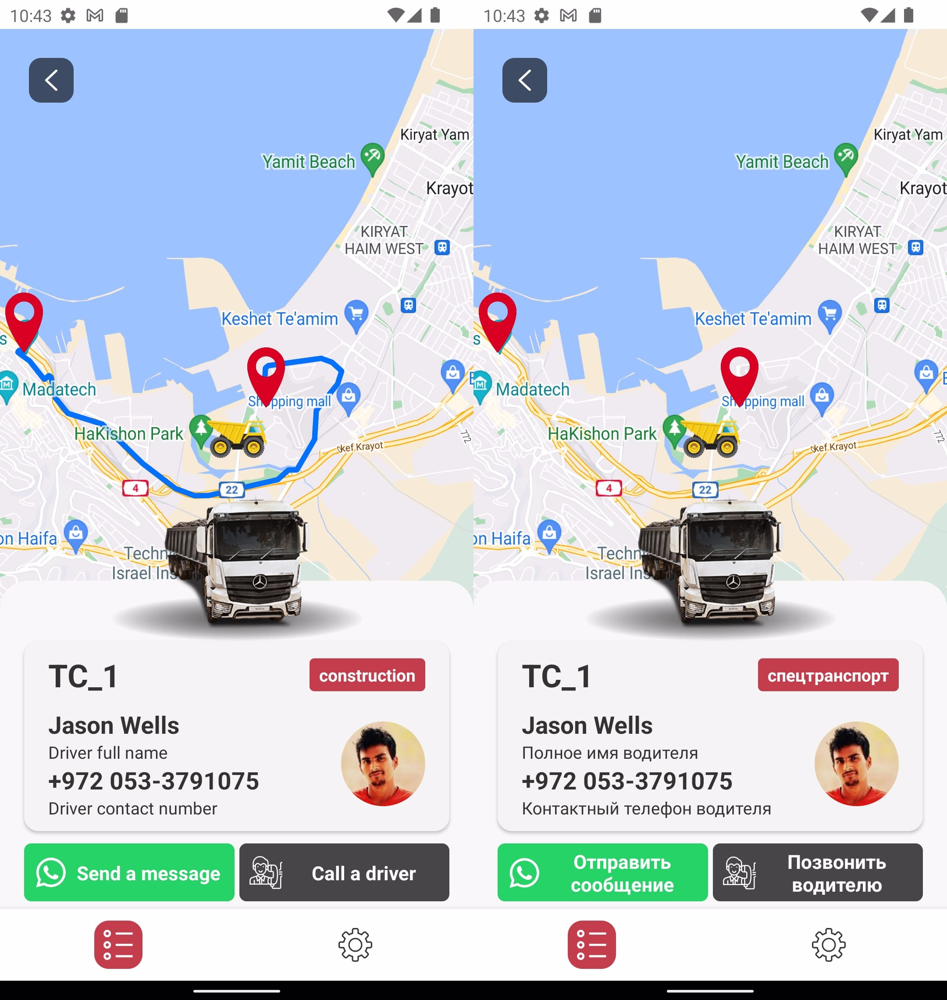
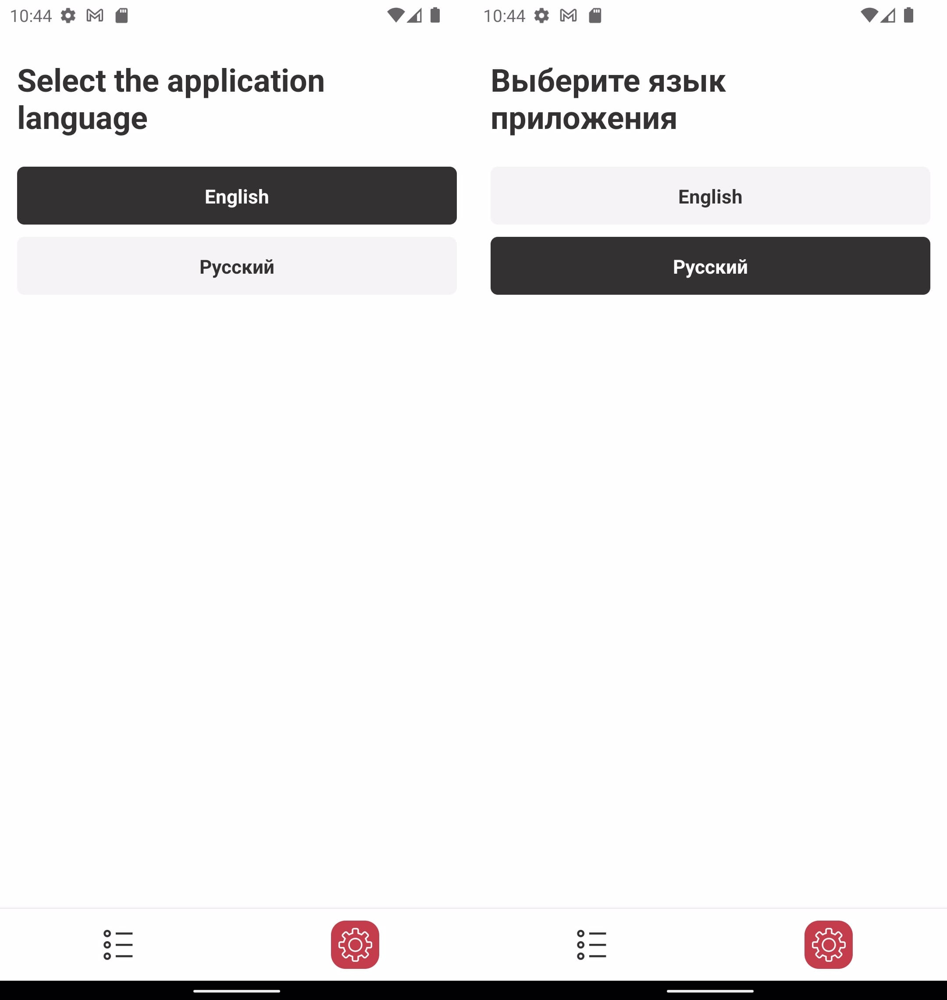

# Transport monitoring - [**React Native**](https://reactnative.dev) project

This is a mobile application that allows to get a list of transport and track the current location and route of the selected transport.

## Table of contents 

- [The assignment](#the-assignment)
- [Built with](#built-with)
- [Screenshots](#screenshots)
- [Running the App](#running-the-app)
---

### The assignment

| Assignment                          |
| -------------------------------- | 
|🚚 Display a list of the vehicles from the **JSON** mock data on the homepage;| 
|✔️ Each element should contain: **vehicle details** such as title, picture, category; **driver details** such as: full name, phone number, avatar;| 
|⬇️ **Sort** vehicles by categories (truck, construction, passenger)|
|📍 Implement **Google Maps** to display all vehicles in the map;|
|🌎 Integrate the direction functionalities using **Google Direction Api**;|
|🅰️ Add **Localization** to two languages: English and Russian; |
|✉️ Send a message to **WhatsApp**;|
|📞 **Call driver** and the driver's number already substituted;|

### Built with

- ****React native****;
- **React-navigation**;
- **Redux toolkit**;
- **Typescript**;
- **React-intl**;

### Screenshots









### Running the App

#### Prerequisites
- Get your [Google Map API key](https://developers.google.com/maps/documentation/javascript/get-api-key) from your Google Maps account
- Create `.env` file and save your GOOGLE_MAPS_API_KEY;

#### Step 1: Download or clone this repository
```
git clone
```

#### Step 2: Install npm
Ensure you have [node package manager (npm)](https://docs.npmjs.com/downloading-and-installing-node-js-and-npm) installed on your machine.

#### Step 3: Install dependencies
Navigate into the `transportMonitoring` directory and install the dependencies using npm
```
cd transportMonitoring
npm install
```
#### Step 4: Install the pod file
Navigate into the `ios` directory and install the pod file.
```
cd ios
pod install
```
#### Step 5: Run the app
Run the app on a simulator or physical device.
```
npm run ios
```
or
```
npm run android
```
